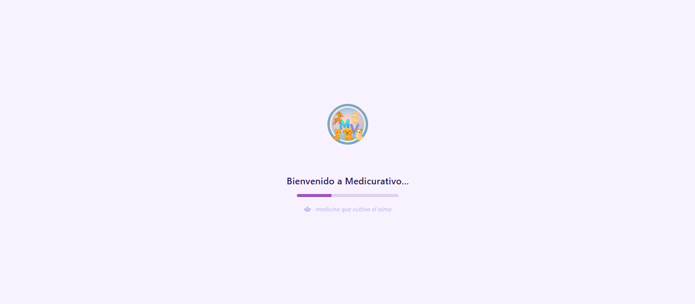
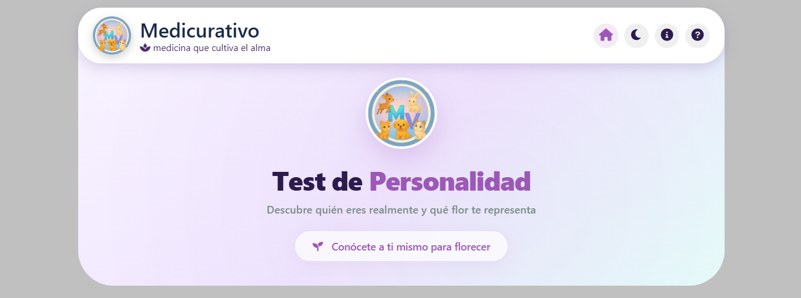
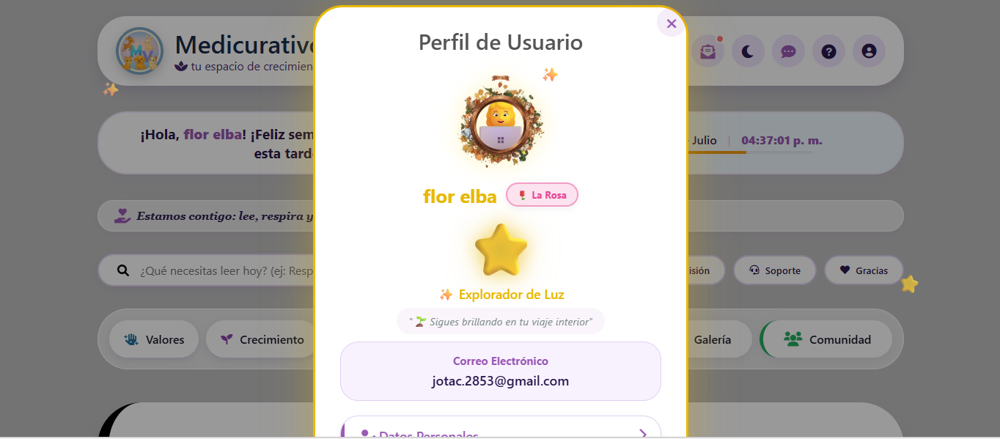
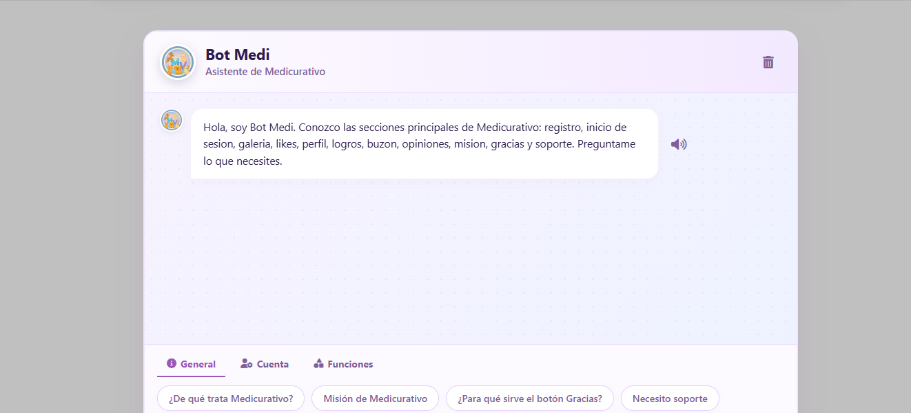

# 🩺 Medicurativo Platform

> Plataforma web interactiva y full-stack diseñada para la comunidad de **Medicurativo**, enfocada en la reflexión de vida, el autodescubrimiento y la interacción comunitaria. 

🌐 **[Visitar Medicurativo en Vivo](https://programas2024.github.io/medicuraty/)**

---

## 📸 Demostración Visual

### 🖼️ Galería del Ecosistema

| 🧠 Test de Personalidad | 🏆 Ranking & Estrellas |
| :---: | :---: |
|  | |
| **✨ Marcos Dinámicos** | **🤖 Asistencia (Bots)** |
|  |  |

| 🖼️ Galería de Imágenes Comunitaria |
| :---: |
|  |

---

## ✨ Características Principales

La plataforma cuenta con una arquitectura robusta y múltiples módulos interactivos:

*   **Reflexiones y Galería Comunitaria:** Espacio dedicado a contenido reflexivo con un sistema de carga de imágenes integrado.
*   **Test de Personalidad Dinámico:** Evaluaciones interactivas con asignación automática de etiquetas de personalidad.
*   **Gamificación y Recompensas (Estrellas y Marcos):** Sistema dinámico donde acumular estrellas desbloquea animaciones avanzadas y marcos interactivos para el perfil.
*   **Ranking de Imágenes & Logros:** Tabla de clasificación en tiempo real y un sistema de desbloqueo de logros protegido por 4 niveles de políticas de seguridad (RLS).
*   **Asistencia con Bots Integrados:** Dos bots automatizados que guían al usuario y mejoran la experiencia dentro de la página.
*   **Autenticación Segura (Passwordless/Email):** Sistema de registro y recuperación de credenciales validado exclusivamente a través del correo electrónico del usuario.
*   **Diseño 100% Responsivo:** Interfaz optimizada con transiciones fluidas para una experiencia impecable en móviles, tablets y escritorio.
*   **Sección Institucional & Feedback:** Espacio "Somos" con el propósito de la marca, enlaces a redes oficiales (TikTok) en el footer, y un módulo para calificar y comentar la plataforma.

---

## 🛠️ Stack Tecnológico & Librerías

Para lograr una experiencia de usuario (UX) interactiva, moderna y segura, se utilizaron las siguientes herramientas:

*   **Frontend:** HTML5, JavaScript Moderno, Animaciones CSS nativas.
*   **Estilos y Maquetación:** **Tailwind CSS** (Diseño fluido, utilidades y responsividad ágil).
*   **Alertas e Interacciones:** **SweetAlert2 (Swal)** (Modales y notificaciones estéticas para el flujo de autenticación y logros).
*   **Iconografía:** **Awesome Icons** (Librería de vectores limpios para la interfaz y tooltips).
*   **Backend & Base de Datos (BaaS):** **Supabase** (PostgreSQL, Auth, Storage y Row Level Security - RLS).

---

## 🔒 Seguridad (Row Level Security)

Para garantizar la integridad de los datos desde un frontend estático, la base de datos implementa **RLS (Row Level Security)** en sus tablas críticas:
*   El sistema de logros cuenta con **4 reglas RLS estrictas** que validan la legitimidad de las acciones antes de registrar un desbloqueo, mitigando riesgos de inyección o manipulación de datos.